# Procedural Dungeon Walkthrough

**A real-time OpenGL 4.1 renderer written from scratch in C++17, with a reproducible benchmark harness to measure what each optimization is really worth.**


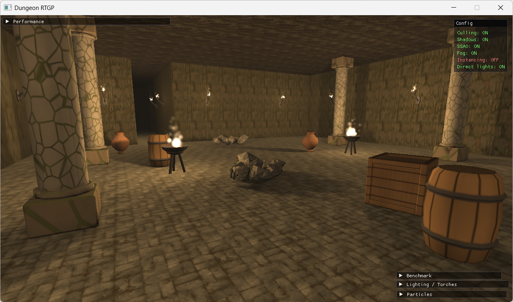

A first-person walkthrough of a procedurally generated dungeon lit only by fire: wall torches and braziers, physically based shading, real-time shadows, ambient occlusion and volumetric fog. No game engine, no Assimp, no physics library: the OBJ loader, the collision system, the chain physics and the renderer are all our own code on top of raw OpenGL.

The goal of the project was not only to make it look good, but to **measure** it. A built-in benchmark harness records a camera path, replays it under different configurations and logs every frame to CSV, so each optimization can be judged with numbers instead of intuition.

> Built for the *Real-Time Graphics Programming* course, MSc in Computer Science, Università degli Studi di Milano (a.y. 2025/2026).

---

## Highlights

| | |
|---|---|
| **Procedural world** | BSP dungeon generator (rooms + corridors, always connected) from a seed, rebuilt live from the HUD |
| **Shading** | GGX / Cook-Torrance forward shading, up to 32 fire lights shaded per frame |
| **Shadows** | 2D shadow maps with PCF for torches (SPOT), single-pass distance cubemaps via a geometry shader for braziers (POINT), smooth fade instead of popping |
| **Post effects** | SSAO (G-buffer, hemisphere kernel, blur) and per-pixel ray-marched volumetric fog |
| **Simulation** | Player collisions against AABBs, Verlet chains that swing when you walk through them, instanced fire particles |
| **Optimizations** | Frustum culling (Gribb-Hartmann planes, AABB positive-vertex test), structural instancing, particle instancing, runtime shadow budget, fog quality knob |
| **Measurement** | Record/replay camera paths, per-frame CSV logging, five automated A/B sweeps, MATLAB analysis script |
| **Tooling** | Dear ImGui HUD with live metrics, frame-time graph, spectator camera that shows the culled volume |

---

## Gallery

<table>
  <tr>
    <td>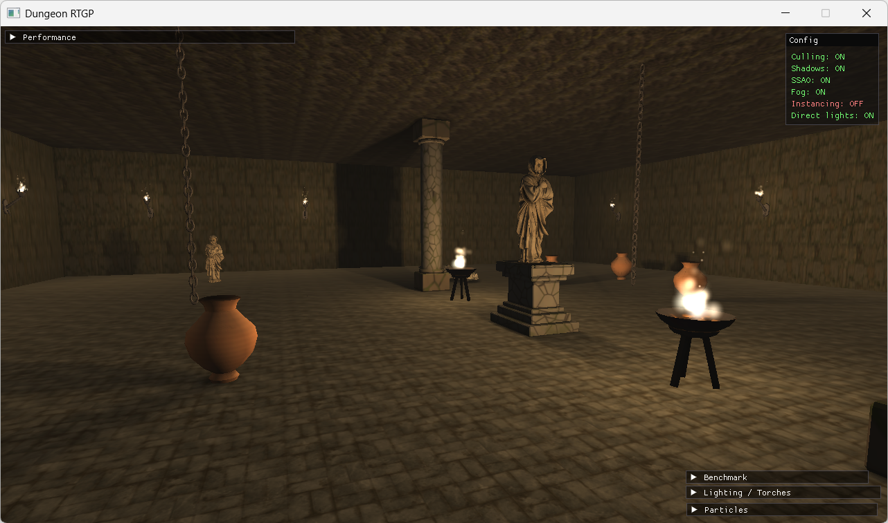</td>
    <td>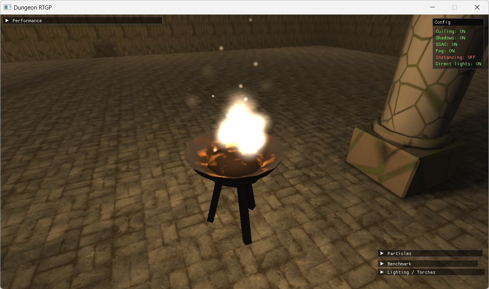</td>
  </tr>
  <tr>
    <td align="center"><sub>Statue room: photoscanned statue on an altar, hanging Verlet chains</sub></td>
    <td align="center"><sub>Instanced fire particles on the braziers</sub></td>
  </tr>
  <tr>
    <td>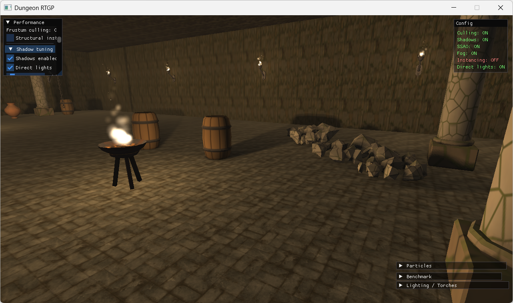</td>
    <td>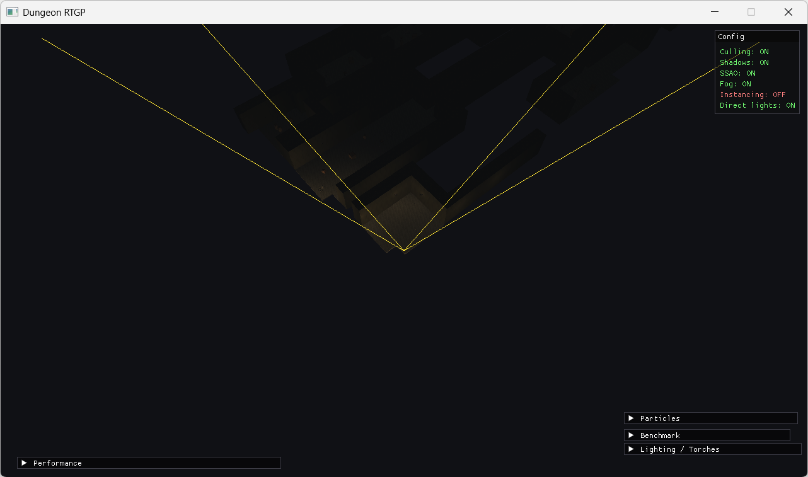</td>
  </tr>
  <tr>
    <td align="center"><sub>Omnidirectional shadows from a brazier (distance cubemap)</sub></td>
    <td align="center"><sub>Spectator camera: only what is inside the player's frustum is drawn</sub></td>
  </tr>
</table>

### Effect comparisons

| Off | On |
|:---:|:---:|
| 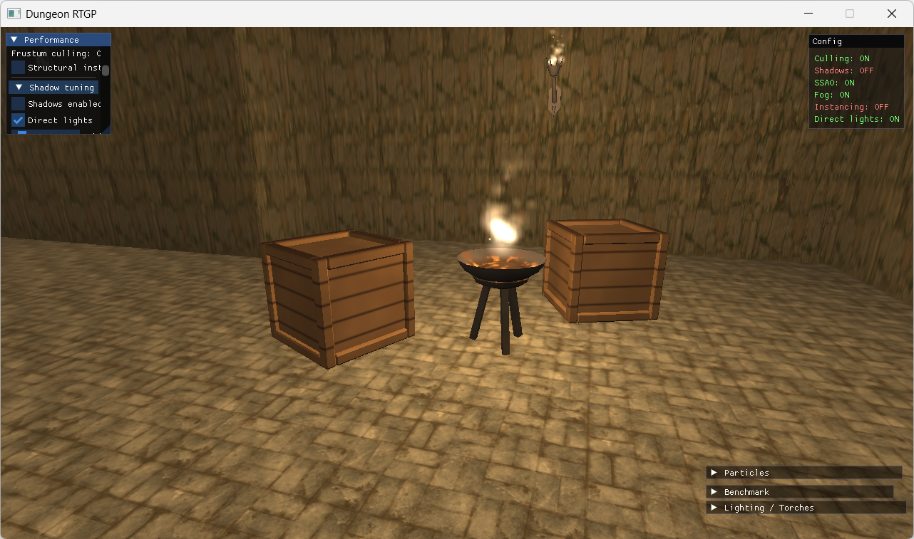 | 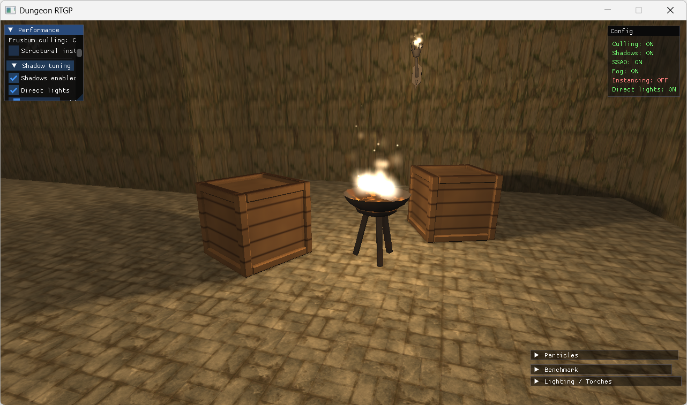 |
| *Shadow mapping off* | *Shadow mapping on* |
| 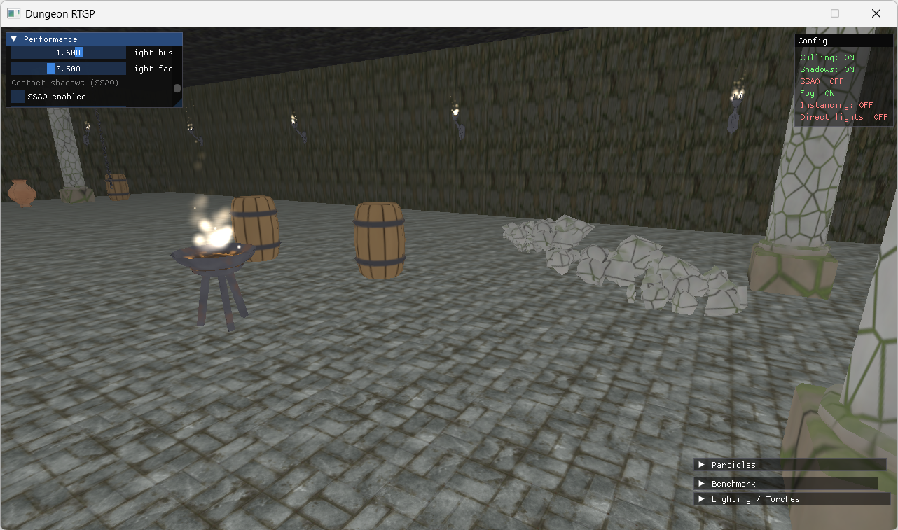 | 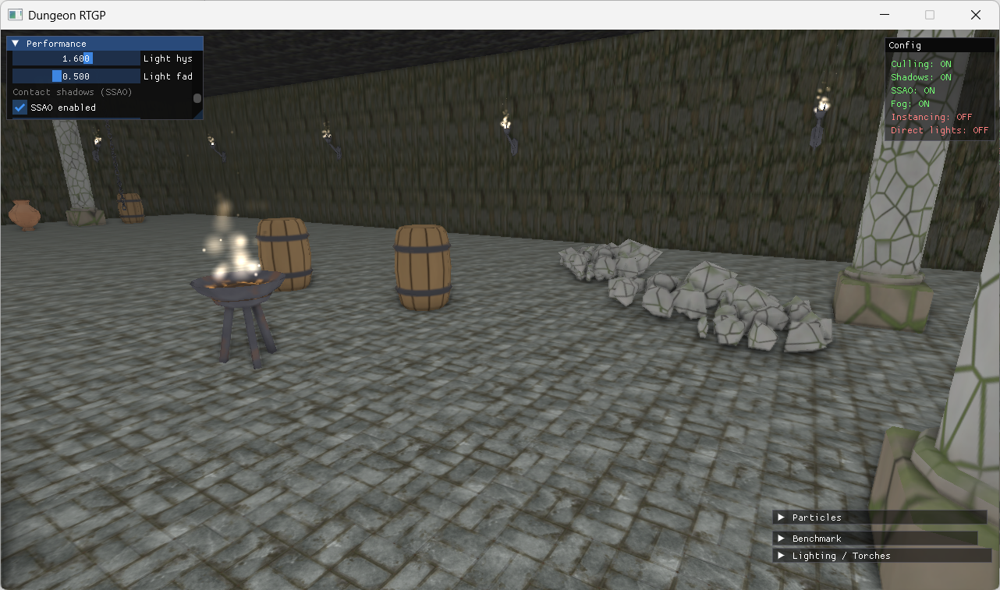 |
| *SSAO off* | *SSAO on* |
| 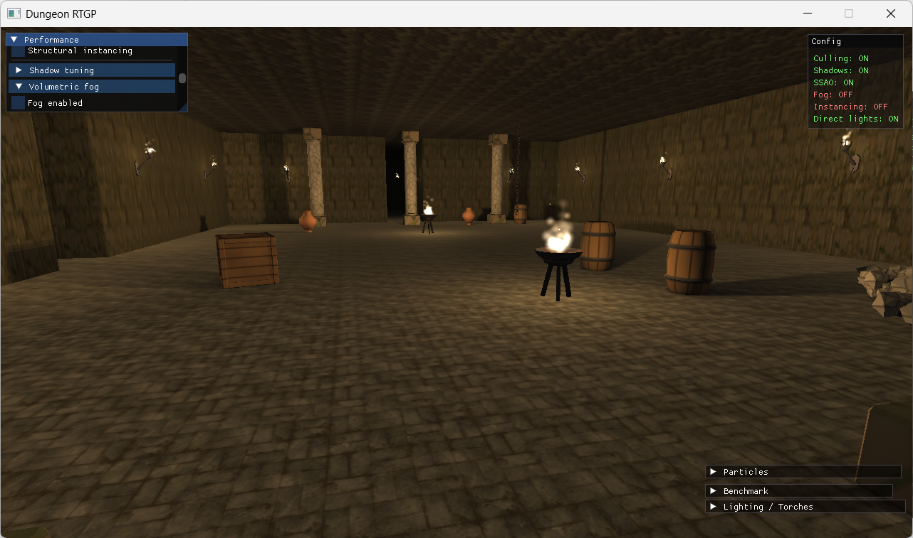 | 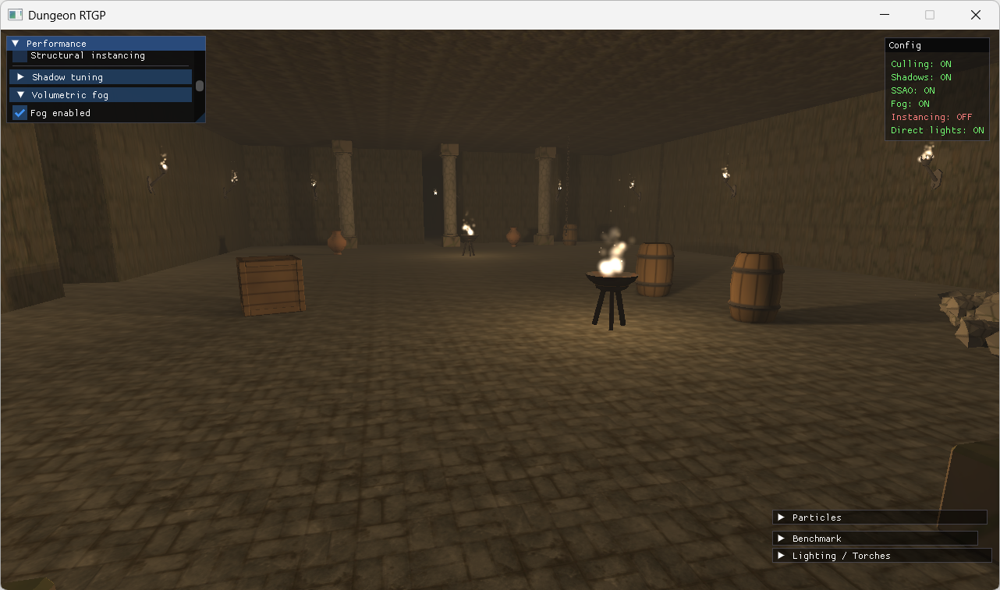 |
| *Volumetric fog off* | *Volumetric fog on* |

---

## How a frame is rendered

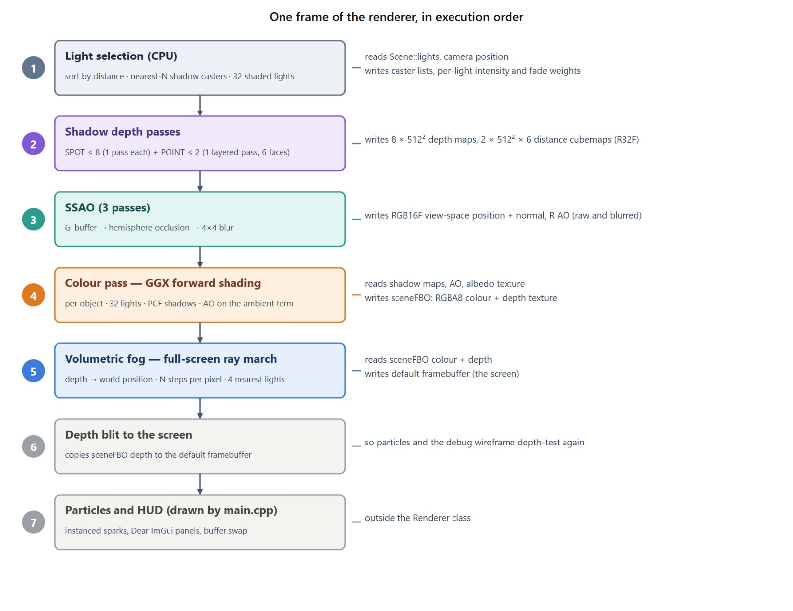

1. **Light selection (CPU):** lights are sorted by distance; the nearest 32 are shaded and the nearest 8 SPOT + 2 POINT become shadow casters.
2. **Shadow depth passes:** one pass per torch into a 512² depth map, one layered pass per brazier into a cubemap (all 6 faces at once with a geometry shader).
3. **SSAO:** view-space G-buffer, hemisphere sampling, 4×4 blur.
4. **Colour pass:** GGX forward shading with PCF shadows and AO on the ambient term, into an offscreen framebuffer.
5. **Volumetric fog:** a full-screen ray march that reconstructs world position from depth and accumulates light scattering from the nearest lights.
6. **Depth blit + overlays:** particles, debug wireframes and the ImGui HUD.

---

## Performance study

Every configuration was replayed on the same recorded 50 s path (seed 12345), **3 runs each**, Release build, VSync off, 1280×720, on an **Intel Iris Xe** integrated GPU. The analysis is in `analysis/analyze_benchmarks.m`.

### The surprising part: draw calls are not the bottleneck

| Experiment | Draw calls | Triangles | Frame time |
|---|---:|---:|---:|
| Culling OFF | 2,278 | 474k | 24.6 ms (median) |
| **Culling ON** | **692** (−69.6%) | **196k** (−58.6%) | **21.5 ms** (median) |
| Per-object structural geometry | 689 | 196k | 23.66 ms |
| **Structural instancing** | **88** | 196k | **23.92 ms** (no change) |

Frustum culling removes 70% of the draw calls and almost 60% of the triangles, yet the frame only gets about 12% faster. Structural instancing cuts draw calls by a factor of 8 and the frame time does not move at all. Frame time and draw calls are only weakly correlated (Pearson r = 0.20). The renderer is **not CPU/submission bound**.

<table>
  <tr>
    <td>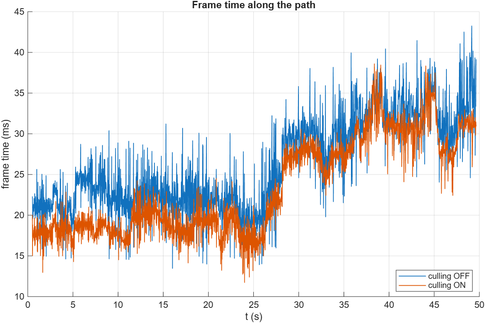</td>
    <td>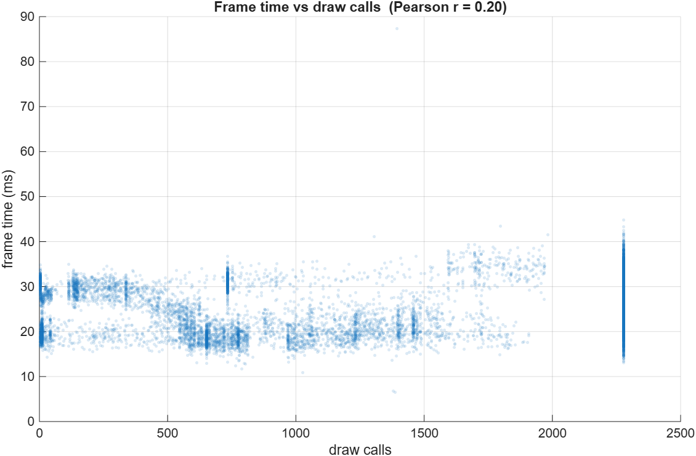</td>
  </tr>
  <tr>
    <td align="center"><sub>Frame time along the path, culling on vs off</sub></td>
    <td align="center"><sub>Frame time vs draw calls: weak correlation</sub></td>
  </tr>
</table>

### Where the time actually goes: fragments and shadows

<table>
  <tr>
    <td>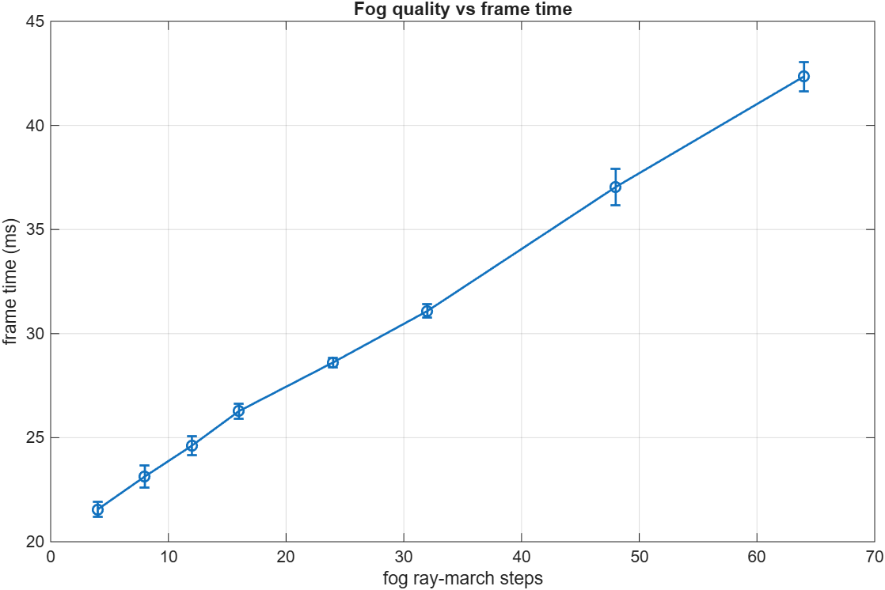</td>
    <td>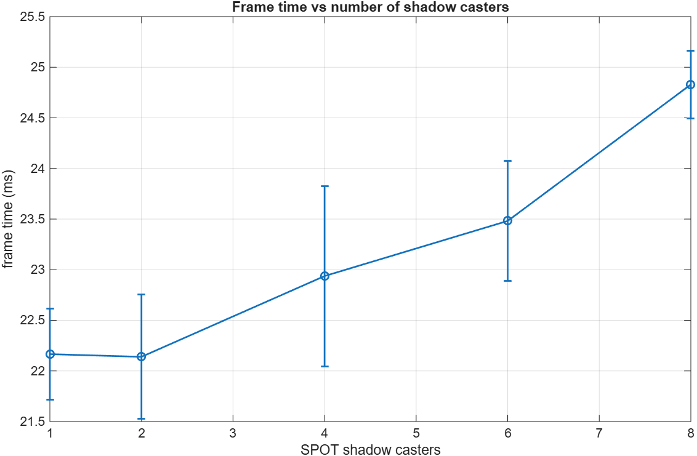</td>
  </tr>
  <tr>
    <td align="center"><sub>Fog ray-march steps 4 → 64: frame time nearly doubles (21.6 → 42.4 ms)</sub></td>
    <td align="center"><sub>SPOT shadow casters 1 → 8: 22.2 → 24.8 ms</sub></td>
  </tr>
</table>

The real levers are **per-pixel work** (the fog ray march scales linearly with the number of steps) and **shadow passes**. The conclusion holds on two more dungeons with very different layouts:

| Seed | Layout | Draw calls | Triangles | FPS gain from culling |
|---|---|---:|---:|---:|
| 12345 | medium | −69.6% | −58.6% | +11.5% |
| 1 | open | −74.1% | −72.2% | +14.6% |
| 777 | corridor / maze | −69.4% | −62.8% | +11.3% |

> Takeaway: on this hardware, optimizing what the CPU submits (culling, instancing) is cheap insurance but not where the frame time is. Optimizing what each pixel computes is.

---

## Build and run

**Requirements:** Windows x64, Visual Studio 2022 with the *Desktop development with C++* workload, a GPU with OpenGL 4.1. All libraries (GLFW, GLAD, GLM, Dear ImGui, stb_image) and assets are vendored in the repo, so there is nothing else to download.

```bash
git clone https://github.com/IlTetta/dungeon-rtgp.git
cd dungeon-rtgp
cmake -S . -B build -G "Visual Studio 17 2022" -A x64
cmake --build build --config Release
build/Release/dungeon.exe
```

Or open the folder in Visual Studio (*File → Open → Folder*) and run `dungeon.exe` with the `x64-Release` configuration. A second console target, `bsp_test`, prints a dungeon layout as ASCII art (`bsp_test.exe <seed>`). More details (in Italian) in [SETUP.md](SETUP.md).

### Controls

| Key | Action |
|---|---|
| WASD / mouse | Move / look |
| Shift | Sprint |
| C | Toggle frustum culling |
| V | Spectator camera (see the culled volume) |
| F1 | Free the cursor to use the HUD |
| Esc | Quit |

### Reproducing the measurements

1. Build in Release and disable VSync from the *Benchmark* window.
2. Load `benchmarks/bench_path_seed12345.txt` and start one of the sweeps (culling × SSAO, particle instancing, structural instancing, shadow budget, fog steps).
3. Run `analysis/analyze_benchmarks.m` in MATLAB (no toolboxes needed) to get the summary table and the plots.

---

## Project structure

```
src/
├── dungeon/   BSP generator + ASCII test program
├── world/     geometry builder, props, collisions, frustum culling, Verlet chains, particles
├── engine/    camera, mesh, OBJ loader, shader and texture helpers
├── render/    renderer, shadow maps, SSAO, fog pass, structural instancer
├── bench/     camera path record/replay, experiment configs, CSV logger
├── hud/       Dear ImGui panels
└── input/     FPS input handling
shaders/       GLSL 410: GGX, shadow (2D + cubemap), G-buffer, SSAO, fog, particles
analysis/      MATLAB benchmark analysis
benchmarks/    recorded reference camera path
```

---

## Credits

- Statue: *Mourner from the Tomb of Philip the Bold*, photoscan from **Scan the World**, licensed **CC-BY**.
- Surface textures: **ambientCG** (CC0).
- Other props (columns, crates, barrels, urns, braziers, torches, chains, rubble, altar) modelled and baked in Blender for this project.
- Libraries: [GLFW](https://www.glfw.org/), [GLAD](https://github.com/Dav1dde/glad), [GLM](https://github.com/g-truc/glm), [Dear ImGui](https://github.com/ocornut/imgui), [stb_image](https://github.com/nothings/stb).
